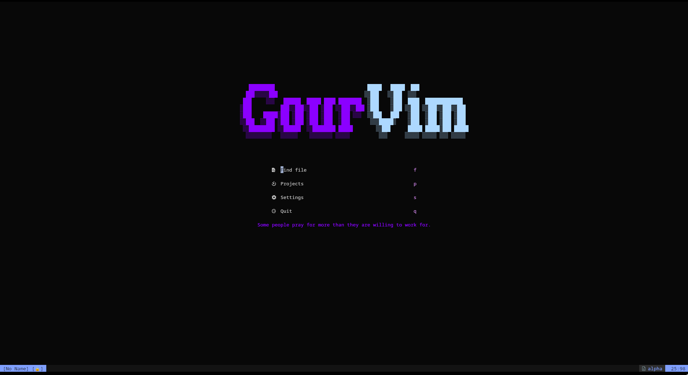

# Neovim Config

This is the config I've been using lately lightweight, modular, and tuned for C++ and java work while remaining handy for other languages.

## Keybindings
Leader key is `<Space>`

### Normal mode

* `<Space>d` — Go to definition (LSP)
* `<Space>D` — Go to declaration (LSP)
* `<Space>i` — Go to implementation (LSP)
* `<Space>r` — Rename symbol (LSP)
* `<Space>q` — Code action (LSP)
* `<Tab>` — Next buffer (`:bnext`)
* `<S-Tab>` — Previous buffer (`:bprev`)
* `<Space>s` — Save current buffer (`:w`)
* `<Space>e` — Toggle file explorer (`:NvimTreeToggle`)
* `<Space>p` — Change project (`:Telescope projects`)
* `<Space>f` — Telescope: Find files (`:Telescope find_files`)
* `<Space>g` — Telescope: Live grep (`:Telescope live_grep`)
* `<Space>cf` — Run clang-format on current buffer (`:ClangFormat`)
* `<Space>h` — Open LazyGit (`:LazyGit`)
* `<Space>gh` — Open LazyGit (alternative mapping)
* `<Space>/` — Clear search highlight (`:nohlsearch`)
* `<Space>x` — Close buffer with prompt (save / force close options)
* `<A-t>` (Alt + t) — Toggle floating terminal (`:ToggleTerm`)

### Insert / Select mode (completion via nvim-cmp)

* `<C-Space>` — Trigger completion menu
* `<CR>` — Confirm selected completion entry
* `<Tab>` — If completion visible: select next; else if snippet expand/jump; else fallback
* `<S-Tab>` — If completion visible: select previous; else if snippet jump backwards; else fallback
