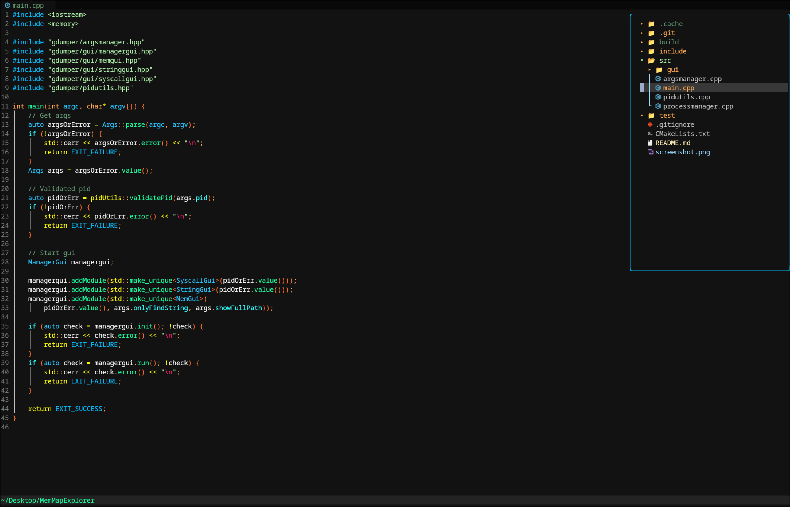

# Neovim Config

This is the config I've been using lately — lightweight, modular, and tuned for C++ work while remaining handy for other languages.

## Basic dependencies
Install these before using the config:
- Neovim 0.9+  
- git  
- ripgrep (`rg`)  
- fd (or `fd-find`)  
- Node.js (some plugins / LSPs)  
- make (for building native extensions)  
- clangd (C/C++ language server)  
- clang-format (code formatter)

## Keybindings
Leader key is `<Space>`

### Normal mode
- `<Space>d` — Go to definition (LSP)  
- `<Space>i` — Go to implementation (LSP)  
- `<Space>r` — Rename symbol (LSP)  
- `<Space>q` — Code action (LSP)  
- `<Tab>` — Next buffer (`:bnext`)  
- `<S-Tab>` — Previous buffer (`:bprev`)  
- `<Space>s` — Save buffer (`:w`)  
- `<Space>e` — Toggle file explorer (NvimTree)  
- `<Space>cf` — Run clang-format on current buffer (`:ClangFormat`)  
- `<Space>x` — Close buffer with prompt (save / force close options)  
- `<Space>f` — Telescope: Find files  
- `<Space>g` — Telescope: Live grep  
- `<Space>gh` — Open LazyGit (`:LazyGit`)  
- `<A-t>` (Alt + t) — Toggle floating terminal (toggleterm)

### Insert / Select mode (completion via nvim-cmp)
- `<C-Space>` — Trigger completion menu  
- `<CR>` — Confirm selected completion entry  
- `<Tab>` — If completion visible: select next; else if snippet expand/jump; else fallback  
- `<S-Tab>` — If completion visible: select previous; else if snippet jump backwards; else fallback

### Dashboard (alpha)
- `e` — Explorer (`:NvimTreeToggle`)  
- `f` — Find file (`:Telescope find_files`)  
- `r` — Recent files (`:Telescope oldfiles`)  
- `q` — Quit (`:qa`)

